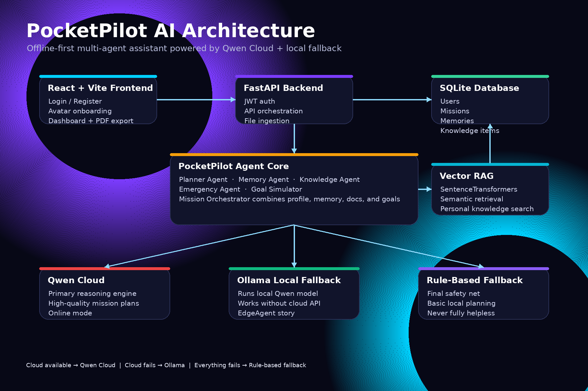

# 🚀 PocketPilot AI

### Your AI shouldn't disappear when the internet does.

PocketPilot AI is an **offline-first multi-agent personal assistant** that helps daily users plan missions, simulate goals, remember preferences, search personal documents, and keep working even when cloud AI fails.

Built for the **Qwen Global AI Hackathon — Track 5: EdgeAgent**.

<p align="center">
  <b>Qwen Cloud when online · Ollama when offline · Rule-based fallback when everything catches fire</b>
</p>

---

## 🧭 The 10-second pitch

Most AI assistants are brilliant until:

- Wi-Fi drops.
- APIs fail.
- The user has to repeat their context again.
- Their documents are scattered everywhere.
- They need a plan, not another chatbot response.

PocketPilot AI is a personal AI command center that remembers who you are, reads your knowledge vault, plans missions, simulates long-term goals, and gracefully falls back from cloud AI to local AI.

In other words:

> **ChatGPT + Notion + personal memory + travel planner + goal coach + offline survival mode.**

---

## ✨ What makes it different?

PocketPilot is not just a chatbot wearing a nice hoodie.

It has:

- 🔐 **User accounts**
- 🙂 **Friendly avatar onboarding**
- 👤 **Persistent profile and preferences**
- 🧠 **Memory Agent**
- 📚 **Knowledge Vault**
- 🔍 **Semantic Vector RAG**
- 🎯 **Mission Mode**
- 🚀 **Goal Simulator**
- 📄 **PDF Export**
- 🌐 **Qwen Cloud primary reasoning**
- 🖥️ **Ollama local fallback**
- 🧯 **Rule-based offline fallback**

If cloud AI fails, PocketPilot does not throw a tantrum. It switches modes.

---

## 🎬 Real-world example

Imagine Alin is travelling from Melbourne to Sydney.

PocketPilot already knows:

- He is budget-conscious.
- He prefers public transport.
- He wants vegetarian food options.
- He likes early-morning checklist-style planning.

He uploads a Sydney travel PDF.

Then asks:

> Plan my Sydney trip and prepare everything offline.

PocketPilot:

1. Reads his profile.
2. Searches memories.
3. Retrieves relevant travel knowledge.
4. Runs multiple agents.
5. Generates a practical mission plan.
6. Exports a printable PDF.
7. Still works if cloud AI disappears.

No context repeated.  
No documents lost.  
No "sorry, I need internet" meltdown.

---

## 🧩 Core Features

### 🎯 Mission Mode

Turns high-level goals into execution-ready plans.

Examples:

- Plan a trip offline.
- Prepare for exams.
- Organize an internship search.
- Build a personal emergency checklist.
- Plan a productive week.

Mission Mode uses:

- Profile
- Memories
- Uploaded knowledge
- Planner Agent
- Knowledge Agent
- Memory Agent
- Emergency Agent
- Qwen/Ollama reasoning

---

### 🚀 Goal Simulator

For long-term goals, PocketPilot creates realistic roadmaps.

Examples:

- "I want to become an AI Engineer in Australia within 12 months."
- "I want to get a software internship in 3 months."
- "I want to move to another city."
- "I want to prepare for finals."

It outputs:

- Goal summary
- Assumptions
- Current state analysis
- Phase-by-phase roadmap
- Timeline
- Required resources
- Risks and mitigation
- Success metrics
- Final execution checklist

---

### 🧠 Memory Agent

Users can save preferences and important notes.

Examples:

- "I prefer public transport."
- "I am vegetarian."
- "I like checklist-based plans."
- "I prefer budget-friendly options."

PocketPilot uses this context automatically in future missions.

---

### 📚 Knowledge Vault

Users can upload:

- PDF
- DOCX
- TXT
- Markdown
- CSV

PocketPilot extracts the text, stores it, embeds it, and retrieves the most relevant knowledge during missions.

---

### 🔍 Semantic Vector RAG

PocketPilot uses SentenceTransformers to create embeddings for uploaded knowledge.

This means a user can ask:

> How should I move around Sydney cheaply?

and PocketPilot can retrieve a document called:

> NSW public transport guide

even if the exact words do not match.

---

### 📄 PDF Export

Any mission plan can be exported as a clean PDF.

Useful for:

- Travel checklists
- Study plans
- Emergency plans
- Career roadmaps
- Offline reference sheets

---

### 🌐 Cloud + Edge AI

PocketPilot has a three-level resilience system:

| Situation | AI Mode |
|---|---|
| Internet and Qwen available | Qwen Cloud |
| Qwen fails but local model works | Ollama |
| Cloud and local model unavailable | Rule-based fallback |

That means PocketPilot is designed around failure instead of pretending failure does not exist.

---

## 🏗️ Architecture



```txt
React + Vite Frontend
        |
        v
FastAPI Backend
        |
        v
PocketPilot Agent Core
        |
        |-- Planner Agent
        |-- Knowledge Agent
        |-- Memory Agent
        |-- Emergency Agent
        |-- Goal Simulator
        |
        v
Orchestrator
        |
        |-- Qwen Cloud API
        |-- Ollama Local Fallback
        |-- Rule-Based Offline Fallback
        |
        v
SQLite Database
        |
        |-- Users
        |-- Missions
        |-- Memories
        |-- Knowledge Items
```

---

## 🤖 Agent System

### Planner Agent

Breaks the user's goal into practical tasks.

### Knowledge Agent

Retrieves relevant information from the user's uploaded files.

### Memory Agent

Uses long-term preferences and saved notes.

### Emergency Agent

Adds offline preparation, risk awareness, and fallback planning.

### Goal Simulator

Builds long-term execution paths for ambitious goals.

### Orchestrator

Combines agent outputs and chooses the best reasoning backend:

1. Qwen Cloud
2. Ollama
3. Rule-based fallback

---

## 🛠️ Tech Stack

### Frontend

- React
- Vite
- Axios
- React Markdown
- React Hot Toast
- Lucide React

### Backend

- FastAPI
- SQLAlchemy
- SQLite
- JWT authentication
- ReportLab

### AI / ML

- Qwen Cloud
- Ollama
- Qwen local model
- SentenceTransformers
- Vector similarity search

### Document Processing

- PyPDF
- python-docx

---

## 🚀 Local Setup

### 1. Clone the repo

```bash
git clone YOUR_REPO_URL
cd PocketPilot-AI
```

### 2. Backend setup

```bash
cd backend
python -m venv venv
venv\Scripts\activate
pip install -r requirements.txt
```

Create `backend/.env`:

```env
QWEN_API_KEY=your_qwen_api_key_here
QWEN_BASE_URL=https://dashscope-intl.aliyuncs.com/compatible-mode/v1
QWEN_MODEL=qwen-plus

OLLAMA_BASE_URL=http://localhost:11434
OLLAMA_MODEL=qwen2.5:3b
ENABLE_OLLAMA_FALLBACK=true
```

Run backend:

```bash
uvicorn app.main:app --reload
```

Backend runs at:

```txt
http://127.0.0.1:8000
```

---

### 3. Frontend setup

```bash
cd frontend
npm install
npm run dev
```

Frontend runs at:

```txt
http://localhost:5173
```

---

## 🖥️ Offline Mode

Install Ollama:

```bash
ollama pull qwen2.5:3b
```

To test offline fallback:

1. Start Ollama.
2. Set `QWEN_API_KEY=wrong_key`.
3. Make sure the embedding model is cached locally.
4. Turn off Wi-Fi.
5. Run Mission Mode.

Expected result:

```txt
Mode: Local Ollama
```

If Ollama is unavailable too, PocketPilot falls back to rule-based offline planning.

---

## 🌍 Deployment

### Backend

Deploy the FastAPI backend to Railway.

Required Railway variables:

```env
QWEN_API_KEY=your_qwen_api_key_here
QWEN_BASE_URL=https://dashscope-intl.aliyuncs.com/compatible-mode/v1
QWEN_MODEL=qwen-plus
ENABLE_OLLAMA_FALLBACK=false
```

For hosted deployment, Ollama fallback is disabled unless a separate Ollama server is deployed.

### Frontend

Deploy the Vite frontend to Vercel.

Required Vercel variable:

```env
VITE_API_URL=https://your-railway-backend-url.up.railway.app
```

---

## 🧪 Demo Flow

A strong 3-minute hackathon demo:

1. Register a new account.
2. Choose a friendly avatar.
3. Add preferences:
   - Budget-friendly
   - Vegetarian
   - Public transport
   - Checklist-based planning
4. Upload a travel document.
5. Run Mission Mode:
   - "Plan my Sydney trip and prepare everything offline."
6. Show agent workflow.
7. Export the mission as PDF.
8. Run Goal Simulator:
   - "I want to become an AI Engineer in Australia within 12 months."
9. Break the Qwen key locally and show Ollama fallback.

---

## 🏁 Why PocketPilot matters

Most AI products are conversations.

PocketPilot is a system.

It remembers.  
It plans.  
It reads.  
It adapts.  
It survives outages.

The next generation of AI assistants should be:

- Personal
- Persistent
- Useful
- Offline-capable
- Calm under pressure

PocketPilot AI is a step toward that future.

---

## 🧠 Built for the Qwen Global AI Hackathon

Track: **EdgeAgent**

PocketPilot demonstrates how Qwen Cloud can power a sophisticated personal assistant while still supporting local fallback, user memory, private knowledge, and offline-ready workflows.
